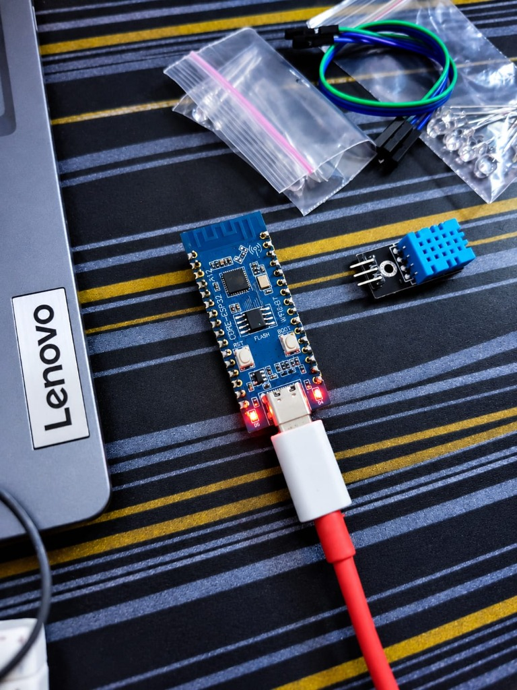
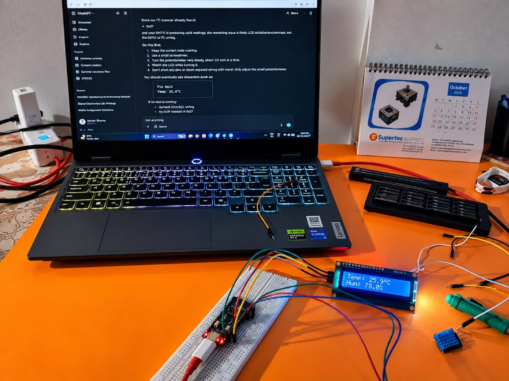

# LCD I²C Display Test

## Objective

Verify communication between the ESP32-C3 and the 16×2 LCD through the I²C interface, and verify combined operation with the DHT11 sensor.

## Hardware

- ESP32-C3 Mini
- 16×2 LCD with I²C backpack
- DHT11 sensor
- Breadboard
- Jumper wires
- USB power

## LCD Pin Connections

| LCD | ESP32-C3 | Description |
|---|---|---|
| SDA | GPIO 4 | I²C Serial Data |
| SCL | GPIO 5 | I²C Serial Clock |
| VCC | 5V | LCD & Backpack Power Supply |
| GND | GND | Common Ground Reference |

**I²C Address**: `0x27`

> [!WARNING]
> **IMPORTANT ELECTRICAL NOTE**:  
> The physical prototype was tested with LCD VCC connected to 5V, SDA to GPIO 4, and SCL to GPIO 5. Because ESP32-C3 GPIO logic operates at 3.3V while the LCD backpack is powered at 5V, the final PCB design must verify I²C logic-level compatibility and determine whether level shifting or another appropriate voltage-matching arrangement is required. Do not alter existing hardware connections during the bench validation phase.

---

## I²C Scanner Result

An I²C bus scanner script was executed on the ESP32-C3 configured with SDA on GPIO 4 and SCL on GPIO 5. The scanner successfully detected an active device at I²C address `0x27`, confirming that bus-level physical and protocol communication between the ESP32-C3 and the LCD backpack controller (PCF8574) was operational.

---

## LCD Display Validation

Upon initial power-up, the LCD backlight turned on and character blocks were visible, but programmed text characters were not immediately legible. 

The contrast potentiometer located on the back of the I²C backpack module was gradually adjusted. Following adjustment, rendered text became crisp and clearly visible.

---

## Combined DHT11 + LCD Test

The DHT11 sensor and 16×2 I²C LCD were tested together with the ESP32-C3 in the following combined hardware configuration:

- **DHT11**: Signal $\rightarrow$ GPIO 3, VCC $\rightarrow$ 3.3V, GND $\rightarrow$ GND
- **LCD**: SDA $\rightarrow$ GPIO 4, SCL $\rightarrow$ GPIO 5, VCC $\rightarrow$ 5V, GND $\rightarrow$ GND, I²C Address $\rightarrow$ `0x27`

Dedicated validation test firmware [`dht11_lcd_test.ino`](file:///C:/Users/aarya/.gemini/antigravity/scratch/Envora/firmware/src/dht11_lcd_test/dht11_lcd_test.ino) was uploaded. The system successfully:
1. Sampled temperature and humidity data from the DHT11 sensor.
2. Formatted and output the sensor readings over the Serial Monitor (`115200` baud).
3. Displayed real-time temperature (`Temp: XX.X°C`) on line 0 of the LCD.
4. Displayed real-time humidity (`Hum: XX.X%`) on line 1 of the LCD.

---

## Result

- **Status**: **PASS**
- **ESP32-C3 + DHT11 + LCD/I²C integration**: **PASS**

## Evidence

---

## Engineering Learning

1. **I²C Bus Scanning**: Running an I²C scanner is a crucial diagnostic step to verify electrical connectivity and bus address response before attempting display initialization or software driver debugging.
2. **Hardware Contrast vs. Communication**: LCD contrast misadjustment is purely a hardware display configuration issue (bias voltage) and does not indicate an I²C bus or protocol communication failure. Isolating bus detection from visual output prevents incorrect diagnostic assumptions.
